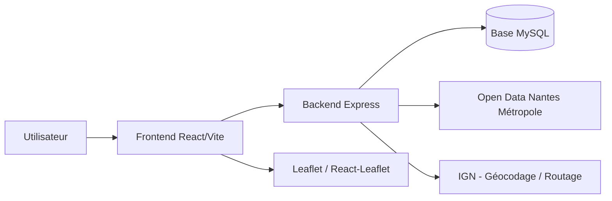

# 🚗 DAPI - Cartographie PMR à Nantes

DAPI est une application web de cartographie dédiée à la recherche de places de stationnement PMR (Personnes à Mobilité Réduite) à Nantes et dans sa métropole. Elle combine un front React/Vite, un back Express et une base MySQL pour proposer une expérience fluide de recherche, géocodage, routage et affichage des emplacements accessibles.

## 1. Description du projet et architecture

### Objectif

L’application permet à un utilisateur de :
- visualiser les emplacements PMR sur une carte interactive,
- rechercher une adresse de départ ou de destination,
- calculer un itinéraire,
- afficher les places PMR proches du trajet,
- consulter des informations utiles sur chaque emplacement.

### Architecture du système



### Structure du dépôt

```text
.
├── src/                  # Frontend React/Vite
├── backend/              # Backend Node.js/Express
├── docker/               # Configuration Docker et Nginx
├── docker-compose.yml    # Stack locale de développement
├── docker-compose.prod.yml # Stack de production
├── .github/workflows/    # CI/CD GitHub Actions
└── README.md             # Documentation principale
```

## 2. Prérequis

- Node.js 20+ recommandé
- npm
- Docker Desktop ou Docker Engine (si vous souhaitez lancer l’application via conteneurs)
- MySQL si vous préférez exécuter le backend hors Docker

## 3. Lancer l’application en local

### Option A — Avec Docker (recommandé)

1. Copier le fichier d’environnement :
   ```bash
   cp .env.example .env
   ```
2. Adapter les valeurs si nécessaire.
3. Lancer la stack :
   ```bash
   docker compose up --build
   ```
4. Ouvrir l’application dans votre navigateur :
   - Frontend : http://localhost:5173
   - Backend : http://localhost:3001
   - Adminer : http://localhost:8081

### Option B — Sans Docker

1. Installer les dépendances du frontend :
   ```bash
   npm install
   ```
2. Installer les dépendances du backend :
   ```bash
   cd backend
   npm install
   ```
3. Vérifier que MySQL est accessible et créer la base si nécessaire.
4. Copier et compléter le fichier d’environnement du backend si besoin.
5. Initialiser la base de données :
   ```bash
   cd backend
   node scripts/initDB.js
   ```
6. Démarrer le backend :
   ```bash
   cd backend
   npm run dev
   ```
7. Démarrer le frontend dans un second terminal :
   ```bash
   npm run dev
   ```
8. Ouvrir l’application sur http://localhost:5173.

### Vérification rapide

- Le frontend doit répondre sur le port 5173.
- Le backend doit répondre sur le port 3001 avec la route `/`.
- Les données PMR doivent se charger depuis l’API backend.

## 4. Déploiement

### Déploiement CI/CD

Le dépôt contient des workflows GitHub Actions pour :
- lint,
- tests,
- build des images Docker,
- publication sur GHCR,
- déploiement SSH sur un VPS.

#### Secrets GitHub à définir

- `SSH_HOST` : adresse du serveur de production
- `SSH_USER` : utilisateur SSH
- `SSH_PRIVATE_KEY` : clé privée SSH


## 5. Contribution

### Standards de développement

- Utiliser des composants fonctionnels React avec hooks.
- Garder une séparation claire entre composants, services et hooks.
- Documenter les fonctions complexes avec JSDoc si nécessaire.
- Préférer un code lisible, testé et maintenable.

### Vérifications à exécuter avant une PR

```bash
npm run lint
npm test
npm run build
```

### Conventions de commit

- `[upgrade]` pour une nouvelle fonctionnalité
- `[fix]` pour une correction de bug
- `[docs]` pour de la documentation

### Processus recommandé

1. Créer une branche dédiée :
   ```bash
   git checkout -b feature/ma-fonctionnalite
   ```
2. Appliquer les changements.
3. Exécuter les vérifications ci-dessus.
4. Ouvrir une pull request avec une description claire.

## 6. Variables d’environnement

Le fichier [.env.example](.env.example) sert de base de configuration.

| Variable | Description | Exemple |
| --- | --- | --- |
| `DB_HOST` | Hôte MySQL | `db` ou `localhost` |
| `DB_USER` | Utilisateur MySQL | `dapi_user` |
| `DB_PASSWORD` | Mot de passe MySQL | `votre_mot_de_passe` |
| `DB_NAME` | Nom de la base | `dapi_pmr` |
| `DB_ROOT_PASSWORD` | Mot de passe root MySQL | `rootpassword` |
| `FRONTEND_PORT` | Port exposé du frontend | `5173` |
| `VITE_API_BASE_URL` | URL de l’API utilisée par le frontend | `/api` |
| `PORT` | Port du backend | `3001` |
| `FRONTEND_IMAGE` | Image Docker du frontend en prod | `ghcr.io/...-frontend:latest` |
| `BACKEND_IMAGE` | Image Docker du backend en prod | `ghcr.io/...-backend:latest` |

## 7. Ressources externes utiles

- GitHub : https://github.com/features/packages
- FrontEnd : https://dev-ops.lukas.gaboriau.mds-nantes.fr
- Backend : https://dev-ops.api.lukas.gaboriau.mds-nantes.fr
- Grafana : https://chipperelderberry2696.grafana.net/d/de9wmgl/conteneur-vps?orgId=1&from=now-6h&to=now&timezone=browser&var-container=$__all&refresh=30s
- Reverse proxy : http://proxy.lukas.gaboriau.mds-nantes.fr/nginx/proxy

## 8. Licence

Ce projet est distribué sous licence MIT.
